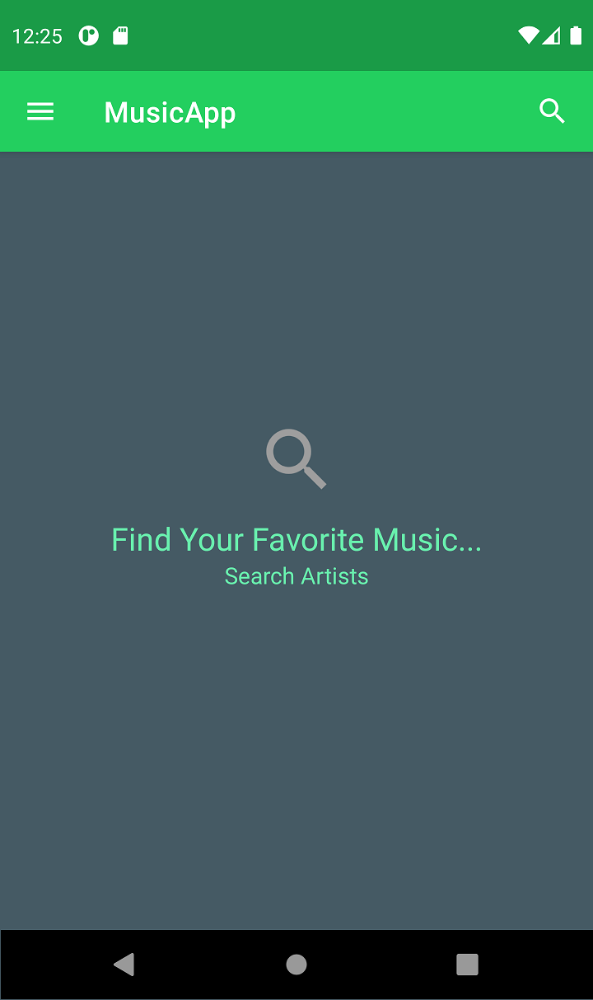
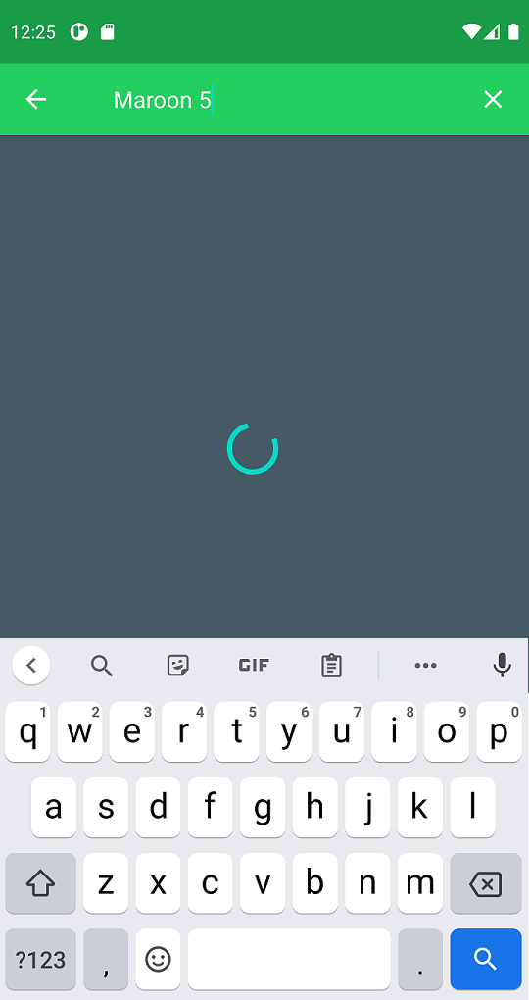

# MusicApp

This is Simple Music Player App Using REST-API.

# Tools
- MVP Design Pattern
- Retrofit
- RxJava/RxAndroid/RxJavaAdapter
- CircularImageView
- Glide
- ConverterGson
- Spotify API

# Features
- Connecting With Database
- Retrieve Data From Database 
- Interacting With JSON API/Web Services
- Play Songs On Spotify
- Search For Specific Songs/Albums

# Screenshots 
There are Some Screenshots to Show How My App Looks. Open Screenshots Folder To See More Pictures

